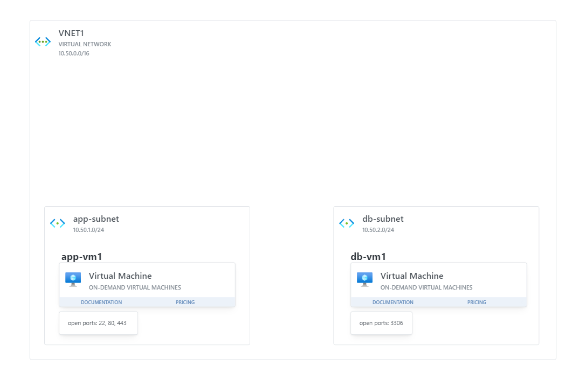

## App and Db Architecture

Your task in this exercise is to create the following Architecture in the cloud.

#### Pre-requisites

- A valid cloud subscribtion (this exercise will use **Azure**)

### Overview

We are deploying our Application to the cloud.

The application is depended on a SQL db. Both the application and the db will run on separate VMs, in separate subnets.

Create a ResourceGroup (you can name it however you want).

Inside the ResourceGroup create a **Virtual Network named "VNET1"** with the address range **10.50.0.0/16**.

Inside the Vnet, create **2 Subnets**: **"app-subnet" (10.50.1.0/24)** and **"db-subnet" (10.50.2.0/24)**.

Create a **linux Virtual Machine** called "app-vm1" and assign it to "app-subnet". **Make sure to create the VM with a Public IP!**

Expose the ports 20, 80 and 443 for the "app-vm1".

Create a **linux Virtual Machine** called "db-vm1" and assign it to "db-subnet". This time, **without a Public IP!**.

Expose the port 3306 for the "db-vm1".

---

Export the template of the ResourceGroup ([how to export a template](https://learn.microsoft.com/en-us/azure/azure-resource-manager/templates/export-template-portal#export-template-from-a-resource-group)) and send it to your teacher.