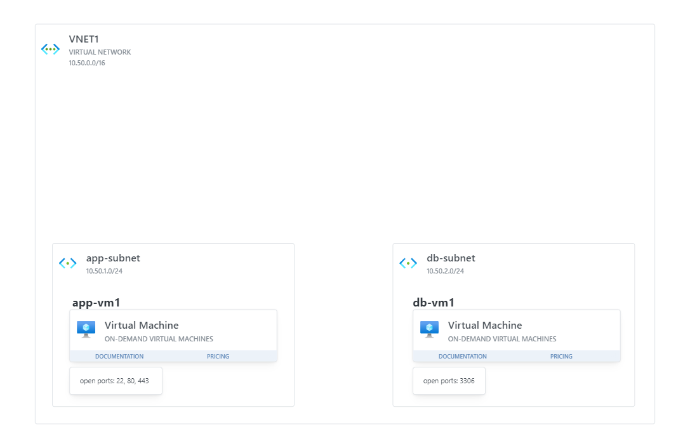

# Terraform Exercise: App and Db Architecture on Azure

In this exercise, you will use Terraform to automate the creation of the cloud architecture you designed for Azure [in a previous exercise](https://github.com/arieluchka/DevOps-Projects-and-Exercises/tree/main/Topics/06-Cloud%20Computing%20(AZ900%2B104)/Exercises/App%20and%20DB%20Architecture). 

## Exercise Objectives

- Write Terraform configuration to define the required cloud resources.
- Use Terraform to provision and manage Azure infrastructure.
- Ensure configurations are reusable and maintain good practices.

## Prerequisites

- [Terraform CLI](https://github.com/arieluchka/DevOps-Projects-and-Exercises/tree/main/pre-requisites#install-terraform-cli) installed on your machine.
- [Azure CLI](https://github.com/arieluchka/DevOps-Projects-and-Exercises/tree/main/pre-requisites#install-azure-cli) installed and configured with your Azure account.

## Instructions

### 1. Setup

Initialize a Terraform project with the necessary files:
- `main.tf`
- `variables.tf`
- `outputs.tf`

Configure the Azure provider. Refer to the [Terraform Azure Provider documentation](https://registry.terraform.io/providers/hashicorp/azurerm/latest/docs) for guidance.

### 2. Define the Infrastructure

Create the following resources using Terraform:

- **Resource Group**: A new resource group for your resources.
- **Virtual Network (VNET1)**: A virtual network with the address space `10.50.0.0/16`.
- **Subnets**: Two subnets named "app-subnet" `10.50.1.0/24` and "db-subnet" `10.50.2.0/24` within VNET1.
- **Public IP**: A public IP for the "app-vm1".
- **Network Security Groups**: Set up rules to allow the required traffic for each VM. (ports 22, 80, 443 for "app-vm1" and port 3306 for "db-vm1")
- **Virtual Machines**: Two Linux VMs named "app-vm1" and "db-vm1".
- **Network Interfaces**: Attach the VMs to the respective subnets.

### 3. Execute Terraform Commands

Run the following commands:
- `terraform init` to initialize the project.
- `terraform plan` to review the execution plan.
- `terraform apply` to apply the configuration and create the resources.

### 4. Verify the Setup

Check the Azure portal to confirm that the resources are created as expected. Test the connection to "app-vm1" using the public IP.

### 5. Clean Up Resources

Use `terraform destroy` to remove all resources after the exercise to prevent extra charges.

## Hints

  
How to know what configuration a resource needs

If you feel stuck, and you are not sure what should be in a specific resource block, visit the [official azurerm documentation](https://registry.terraform.io/providers/hashicorp/azurerm/latest/docs) and search for the resource there.

For example, searching for the "subnet" [resource](https://registry.terraform.io/providers/hashicorp/azurerm/latest/docs/resources/subnet) we can see **what arguments are required** and what is optional.

  
Full resource list and links

Below is a list of the Terraform resources required for the Azure architecture exercise, along with links to their official documentation.

- [`azurerm_resource_group`](https://registry.terraform.io/providers/hashicorp/azurerm/latest/docs/resources/resource_group)
  - Defines a resource group to organize all Azure resources in a single location.

- [`azurerm_virtual_network`](https://registry.terraform.io/providers/hashicorp/azurerm/latest/docs/resources/virtual_network)
  - Creates a virtual network that provides networking capabilities to your resources.

- [`azurerm_subnet`](https://registry.terraform.io/providers/hashicorp/azurerm/latest/docs/resources/subnet)
  - Defines a subnet within the virtual network to segregate the network architecture.

- [`azurerm_public_ip`](https://registry.terraform.io/providers/hashicorp/azurerm/latest/docs/resources/public_ip)
  - Allocates a public IP address to make your VM accessible over the internet.

- [`azurerm_network_interface`](https://registry.terraform.io/providers/hashicorp/azurerm/latest/docs/resources/network_interface)
  - Configures network interfaces for virtual machines.

- [`azurerm_network_security_group`](https://registry.terraform.io/providers/hashicorp/azurerm/latest/docs/resources/network_security_group)
  - Creates a network security group for setting up security rules.

- [`azurerm_network_security_rule`](https://registry.terraform.io/providers/hashicorp/azurerm/latest/docs/resources/network_security_rule)
  - Specifies individual security rules within a network security group. (expose the necessary ports)

- [`azurerm_linux_virtual_machine`](https://registry.terraform.io/providers/hashicorp/azurerm/latest/docs/resources/linux_virtual_machine)
  - Provisions Linux virtual machines within your Azure infrastructure.

