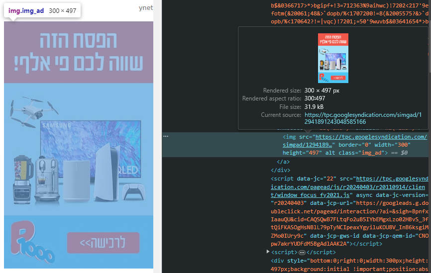
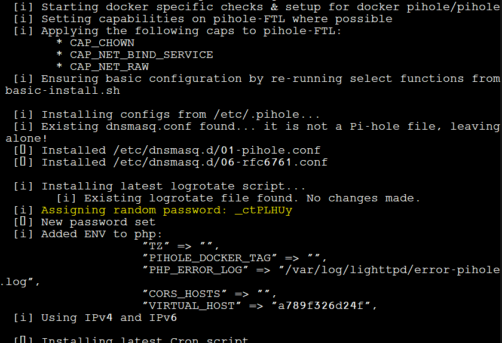
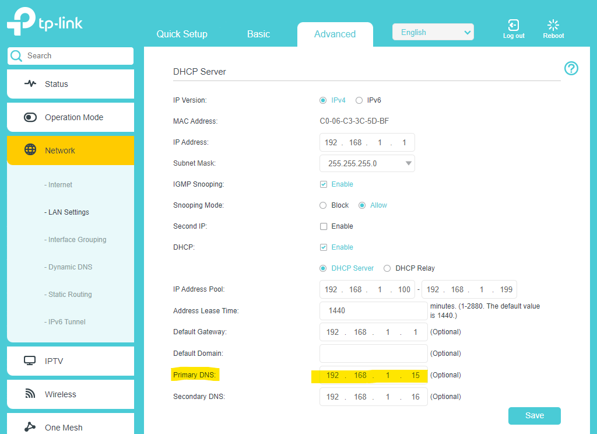

# Self hosted DNS server
## Intro

[DNS in 100 seconds](https://www.youtube.com/watch?v=UVR9lhUGAyU) - a refresher for a DNS is.

When we use different service (like when we search for a website), our computer usually connects to a different computer (to see the website/watch netflix/youtube). 

To be able to connect to that service, **our device needs to know the IP** of the service host (The computer that hosts the website). Because we are having trouble remembering long and random numbers (54.32.123.253) for every service, we developed the DNS.

When we visit sites that have ads, they (the ads) are usually hosted on other computers (not the website host we connected to).

If we go to [ynet.com](https://www.ynet.co.il/) for example (make sure your ad blocker is turned off, if you have any), we can see that if we inspect this ad, it actually coming from another URL:

To see this ad, our computer had to translate this Domain to an IP, so it can connect to the Server hosting this ad and download it.

But... what if we didnt translate the domain of **tpc.googlesyndication.com** to it's IP address?

## End goal

Using docker and containers, this exercise will help you create your own local DNS server that will take your web browsing from this:

To this:

And the best part? Creating a local DNS server will block ads to **EVREY** device on the network, whether its your laptop, your moms phone, the family ipad or the smart TV. (It **wont** block YouTube ads thought)

## Prerequisites
- container engine ([Docker for desktop](https://www.docker.com/products/docker-desktop/)) + familiarity with basic docker commands
- Understanding how [DNS works](https://www.youtube.com/watch?v=mpQZVYPuDGU) (specifically the role of the local DNS server/Resolver server)
- **BONUS** The username and password for your router. (only if you want to set the DNS server for the whole network)

## Overview
There are 2 popular projects for **ad blocking DNS servers**:
- [PiHole](https://pi-hole.net/)
- [AdGuardHome](https://adguard.com/en/welcome.html)

Both are available as docker images!

Choose one that you like and go with it (the tutorial will use PiHole). 

#### Tip
Try to figure out the correct commands **without** looking at dockerhub. This Will help you practice and reinforce your knowledge! (But if you get stuck, you can always find the official image on dockerhub!)

**SPOILERS for when you feel stuck**

  
PiHole dockerhub link

  Use this [link](https://hub.docker.com/r/pihole/pihole) if you feel stuck.
  If you decide to proceed and do the exercise using dockerhub, i recommend you do it again after this exercise, but with AdGuard!
  
  This way you'll be able to practice it. 
  

  
AdGuardHome dockerhub link

  Use this [link](https://hub.docker.com/r/adguard/adguardhome) if you feel stuck.
  If you decide to proceed and do the exercise using dockerhub, i recommend you do it again after this exercise, but with PiHole!
  
  This way you'll be able to practice it. 
  

### Steps
---
1) Choose what DNS server you want to deploy (PiHole vs AdGuard).

    PiHole image: pihole/pihole:latest
    
    AdGuard image: adguard/adguardhome:latest
---
2) Find what ports you need to expose! **What ports does the DNS protocol uses?** You will need to expose the DNS ports as **TCP** and as **UDP**.

    Additional ports:
    
    1) For PiHole, you would also want to expose port 80 (as tcp).
    2) For AdGuard, you would also want to expose ports 80 and 3000 (as tcp). 
    3) **Bonus** both projects can also work as a DHCP server. If you are intrested to use this functionality, you would also need to find what port the DHCP protocol uses, and expose it as well! 

    [How to expose container ports?](https://docs.docker.com/network/#:~:text=Here%20are%20some%20examples%3A)
---
3) Go ahead and run the `docker run` commadn, using the configuration you've created!

    

    
Hint 1 - container port mapping command (Use only if you are stuck!!!)

    -p \<host-port>:\<container-port> 
    ---
    Used to [map](https://docs.docker.com/network/#:~:text=Here%20are%20some%20examples%3A) container ports to the host machine.
  
    

    

    
Hint 2 - The full docker run command (Use only if you are stuck!!!)

    PiHole command

    `docker run -d -p 53:53/tcp -p 53:53/udp -p 80:80 pihole/pihole:latest`

    AdGuard command

    `docker run -d -p 53:53/tcp -p 53:53/udp -p 3000:3000 -p 80:80 adguard/adguardhome:latest`

    

---
4) Great! To see the admin panel, go to `localhost:3000` (for adguard) or `localhost:80/admin` (for pihole) on your web browser.

    For AdGuard, you can go ahead and start setup!

    For PiHole, it asks you for a password :(
    
    

    
password for pihole

    To get the password, run `docker logs <pihole container name>` and it should showup there somewhere

    
  
    

    

    
Bonus for PiHole users

    You can set **your own** password using [**Environment Variables**](https://docs.docker.com/reference/cli/docker/container/run/#env)

    Delete the container and run it again, adding the WEBPASSWORD=\<your password> environment variable.
  
    

    
Full command with custom password (USE ONLY IF YOU ARE STUCK)

    `docker run -d -e WEBPASSWORD=z1z2z3z4z5 -p 53:53/tcp -p 53:53/udp -p 80:80 pihole/pihole:latest`

    

    

---
**BONUS - Volumes**

5) What if we delete our container, and run it again? 

    All the setup and configurations that we've made will be gone! why?
    

    
Answer

    All the configuration files are saved in the container. 
    
    If we delete the container, or if something happens to it, we would need to set everything up again!
  
    

    To make sure our settings and configuration files are safe, we can bind a volume from our host machine, to the container.

    #### PiHole
    Saves their files on `/etc/pihole`
    #### AdGuard
    Saves their files on 
    `/opt/adguardhome/work` and `/opt/adguardhome/conf` 

    Delete the container, and **try to run it again with** [**attached volumes**](https://docs.docker.com/storage/volumes/#choose-the--v-or---mount-flag).
    
     Make sure you can enter the setup site. Try to change some settings/configure some stuff on the admin panel.

    To check if you attached the volumes correctly, you can try to delete the container again, and re-run it. Once it's up, if all of your settings are intact, then you did a great job!

    

    
New run commands

    Pihole `docker run -d -e WEBPASSWORD=z1z2z3z4z5 -p 53:53/tcp -p 53:53/udp -p 80:80 -v "c:/path/to/your/folder:/etc/pihole" pihole/pihole:latest`
  
    AdGuard `docker run --rm -d -p 53:53/tcp -p 53:53/udp -p 3000:3000 -p 80:80 -v 'C:/path/to/folder1:/opt/adguardhome/work' -v 'C:/path/to/folder2:/opt/adguardhome/conf' adguard/adguardhome`

    

---
6) You have your first local DNS server! hooray!

    To use it, you need to configure your computer to use the container, when it searches for an IP address.

    Find the IP address of your host machine (you can use `ipconfig` on windows) and [change the Primary DNS server](https://www.youtube.com/watch?v=e6mL6_FCbeo) of your machine, to it's own IP! (dont add a secondery DNS)

    Now, When your computer searches for a site, it **wont** go to the ISP DNS server, but to the DNS server **you** created. 

---

BONUS

If you want all the devices on the network to use this DNS server, you need to set your router to use the container as the DNS server (in the routers DHCP settings).

On tp-link routers, it will look like this (my containers IP is 192.168.1.15, yours my vary)

---
### Final Notes

You used docker to create a real **local DNS server**!

If you had problems setting everything up, and **used hints** and **dockerhub**, try to do it again but with the second app, but now, without using hints!

### IMPORTANT
The ad block will function as long as the container is up! If it's stopped/deleted, devices that use the container as a DNS server, **Wont have internet!**

**Use in your own risk!**

Its recommended to set the DNS server on an old laptop/[raspberry pi](https://www.raspberrypi.com/), and keep it running 24/7!