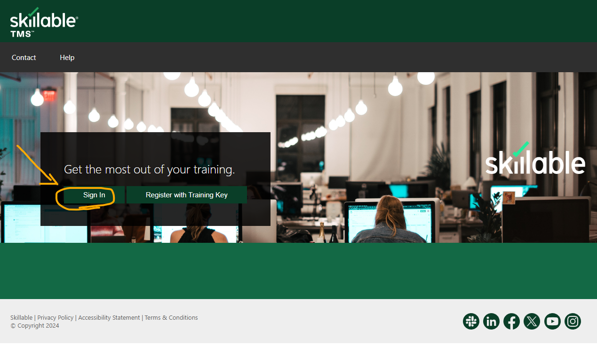
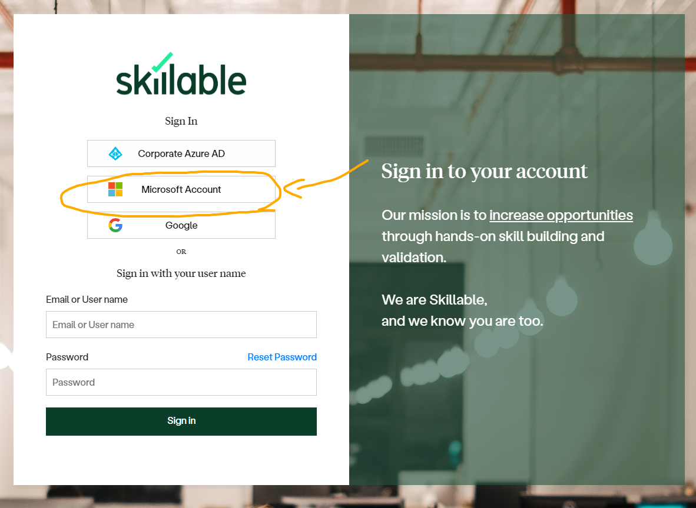
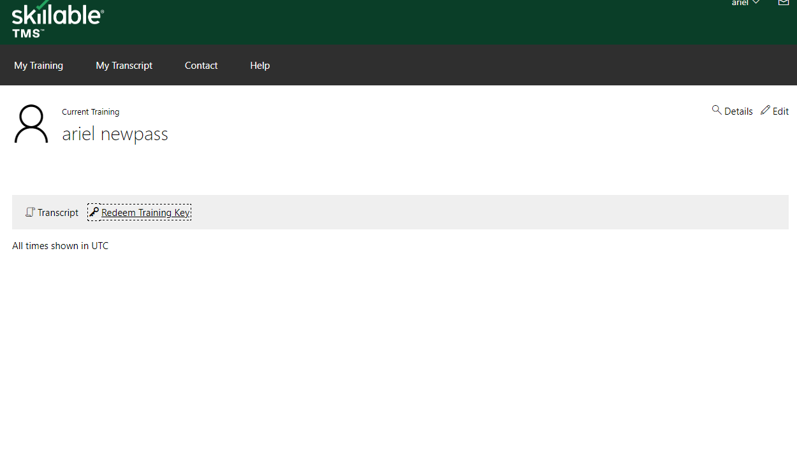
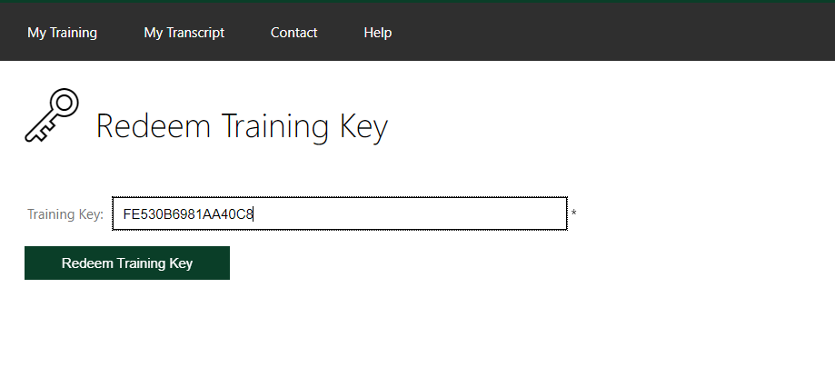
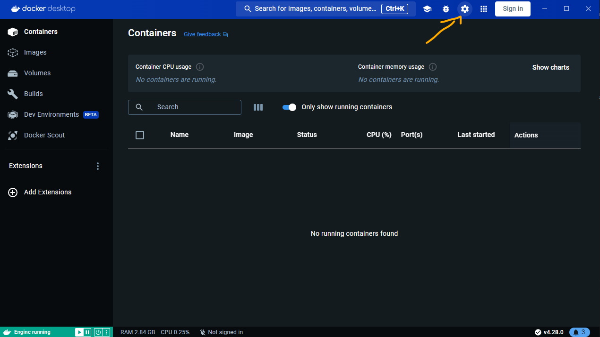
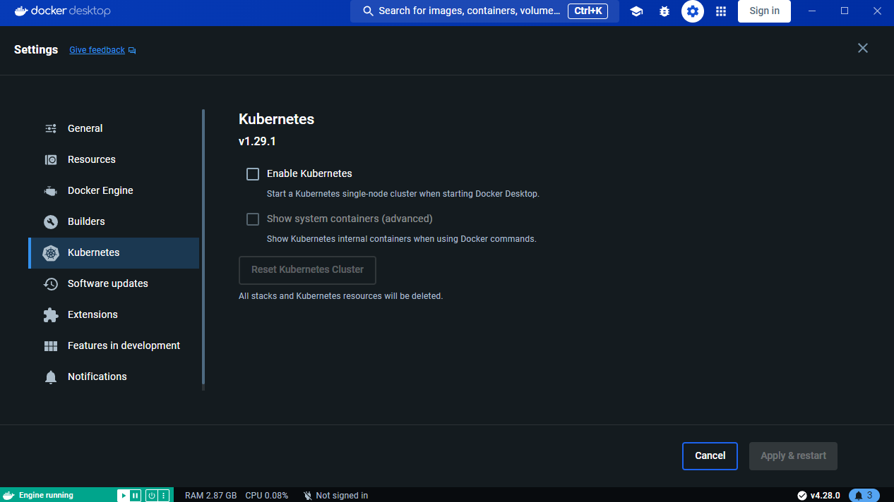
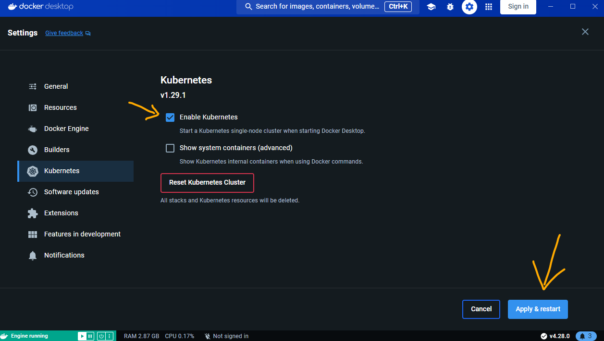

Hi all!

Some of the projects, exercises and labs will require prior setup for everything to work smoothly!

## Enable showing hidden files and folders
Sometimes, some folders and files are hidden by default!
This is usually the case with system files.

But for you to see and understand the entire process and the "behind the scenes", it's better if we'll be able to see those hidden items.

[How to enable in windows 10](https://www.youtube.com/watch?v=SLvHzL12028&t=12s)

[How to enable in windows 11](https://youtu.be/b-9RCmyvEY8?si=tTIebmxZorDDDRPL&t=7)

[How to enable on Mac](https://www.youtube.com/watch?v=LOrjsMHTk0c)

In Linux, Hidden files and folders will usually begin with a dot "." and will be hidden by default when using the `ls` command.

BUT! Using the `ls` command with the flag `-a` will let you see all folders and files (even the hidden ones). [Article](https://www.makeuseof.com/view-hidden-files-and-folders-linux/#:~:text=Hidden%20files%20are%20mainly%20used,out%20of%20your%20Bash%20sessions.) with more info on hidden files on Linux.

## Enable showing Extensions for files
This one is very important for windows users!

Windows will usually create new files with the `.txt` extension, but will hide it by default!

so if you want to add an extension, and you didn't activate the "see file extensions" feature, you could think that you added a `.py` to a file, but actually its saved as `.py.txt` 

[How to enable in windows 10](https://youtu.be/PoTah9YBG2Y?si=JBXWEaMPbaiRAqHj&t=23)

[How to enable in windows 11](https://youtu.be/z5FBLAagPIc?si=4kFqGLXrxVtIefRD&t=22)

[How to enable in mac](https://youtu.be/QnJmtfA3A_g?si=xhHZrrEjRS5Ofofb&t=29)

## How to activate Azure Sponsership (AZ-900/AZ-400) through a skilable code
**Important** 

do all the steps through incognito mode!!

1) create a new [outlook mail](https://www.microsoft.com/en-us/microsoft-365/outlook/email-and-calendar-software-microsoft-outlook) (write down the mail and password somewhere!)

2) go to [skilable website](https://alh.learnondemand.net/User/Login?ReturnUrl=%2F) and sign it with the new outlook email you created. (incognito!!!)

3) press on "Redeem Training Key" and enter your key.

**TO CONTINUE**

## How to activate Kubernetes from Docker-For-Desktop
(make sure you already have [kubectl](https://kubernetes.io/docs/tasks/tools/#:~:text=kubectl%20is%20installable%20on%20a%20variety%20of%20Linux%20platforms%2C%20macOS%20and%20Windows.%20Find%20your%20preferred%20operating%20system%20below.) installed and [docker for desktop](https://www.docker.com/products/docker-desktop/))

(official docker [documentation](https://docs.docker.com/desktop/kubernetes/))

1) Open Docker Desktop and go to settings -> Kubernetes 

2) Enable Kubernetes and Apply & restart

3) Open PowerShell/CMD and try the command `kubectl get nodes`
If you see `docker-desktop` as the node, then everything is good :)

4) If you get lots of errors, try the command `kubectl config get-contexts` to see what contexts you have ([what is k8s context](https://aptakube.com/blog/complete-guide-to-kubeconfig-kubernetes-contexts)).
5) To switch to the `docker desktop` context, enter the command `kubectl config use-context docker-desktop`. 
6) Now try again to get all the nodes!

## How to create Dockerhub account
[follow this guide](https://dockerlabs.collabnix.com/workshop/docker/dockerhub)